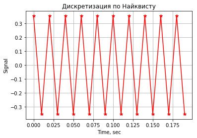
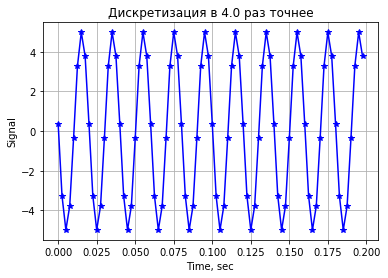
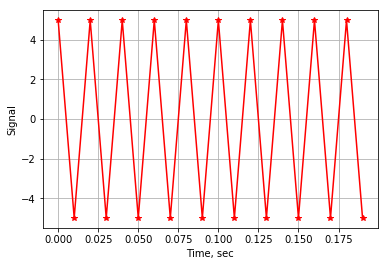
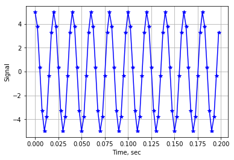

# Нейронные сети
# Лабораторная работа 1
# Программа диалогового задания гармонического сигнала и его визуализации


```python
import numpy as np
import matplotlib.pyplot as plt

%matplotlib inline
```


<script type="text/javascript">window.PlotlyConfig = {MathJaxConfig: 'local'};</script><script type="text/javascript">if (window.MathJax) {MathJax.Hub.Config({SVG: {font: "STIX-Web"}});}</script><script>requirejs.config({paths: { 'plotly': ['https://cdn.plot.ly/plotly-latest.min']},});if(!window._Plotly) {require(['plotly'],function(plotly) {window._Plotly=plotly;});}</script>


# Ввод частоты и амплитуды сигнала


```python
f0  = float(input('Введите частоту сигнала в герцах: '))
A   = float(input('Введите амплитуду сигнала в условных единицах: '))
phi = float(input('Введите фазу сигнала, рад: '))
NT  = float(input('Введите количество периодов наблюдения, ед.: '))
mvis = float(input('Введите коэффициент уменьшения интервала дискретизации: '))
```

    Введите частоту сигнала в герцах: 50
    Введите амплитуду сигнала в условных единицах: 5
    Введите фазу сигнала, рад: 1.5
    Введите количество периодов наблюдения, ед.: 10
    Введите коэффициент уменьшения интервала дискретизации: 4
    


```python
w   = f0*(2.*np.pi)    # Переход к круговой частоте (рад/сек)
T   = 1/f0       # Период исходного сигнала (сек)
dtn = np.pi/w       # Интервал дискретизации Найквиста (теорема Котельникова)
dtv = dtn/mvis   # Интервал дискретизации, пригодный для визуализации

Tnab = NT*T      # Интервал наблюдения (сек)
print(f'Интервал наблюдения = {Tnab} сек')
Nn = Tnab/dtn      # Количество точек в интервале наблюдения для дискретизации Найквиста
Nv = Tnab/dtv      # Количество точек в интервале наблюдения для интервала дискретизации, 
                  # пригодного для визуализации

```

    Интервал наблюдения = 0.2 сек
    


```python
print(f'Количество точек в интервале наблюдения для дискретизации Найквиста = {Nn}')
print(f'Количество точек в интервале наблюдения для интервала дискретизации, пригодного для визуализации, = {Nv}')
```

    Количество точек в интервале наблюдения для дискретизации Найквиста = 20.0
    Количество точек в интервале наблюдения для интервала дискретизации, пригодного для визуализации, = 80.0
    


```python

tn = dtn*np.arange(Nn) # Вектор времени (сек), дискретизированный
                   # в соответствии с критерием Найквиста
tv = dtv*np.arange(Nv) # и c интервалом дискретизации,
                   # пригодным для визуализации
y1n = A*np.cos(2*np.pi*f0*tn+phi)
y2n = A*np.sin(2*np.pi*f0*tn+phi)
                  # Вектора сигналов, дискретизированных
                  # в соответствии с критерием Найквиста
y1v = A*np.cos(2*np.pi*f0*tv+phi)
y2v = A*np.sin(2*np.pi*f0*tv+phi)
                  # Вектора сигналов, дискретизированных
                  # c интервалом дискретизации,
                  # пригодным для визуализации
```


```python
plt.plot(tn,y1n,'r-*')
plt.title('Дискретизация по Найквисту')
plt.xlabel('Time, sec')
plt.ylabel('Signal')
plt.grid()
```





```python
plt.plot(tv,y1v,'b-*')
plt.title(f'Дискретизация в {mvis} раз точнее')
plt.xlabel('Time, sec')
plt.ylabel('Signal')
plt.grid()
```





```python
plt.plot(tn,y2n,'r-*')
plt.xlabel('Time, sec')
plt.ylabel('Signal')
plt.grid()
```





```python
plt.plot(tv,y2v,'b-*')
plt.xlabel('Time, sec')
plt.ylabel('Signal')
plt.grid()
```




